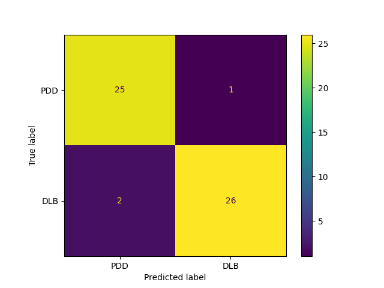
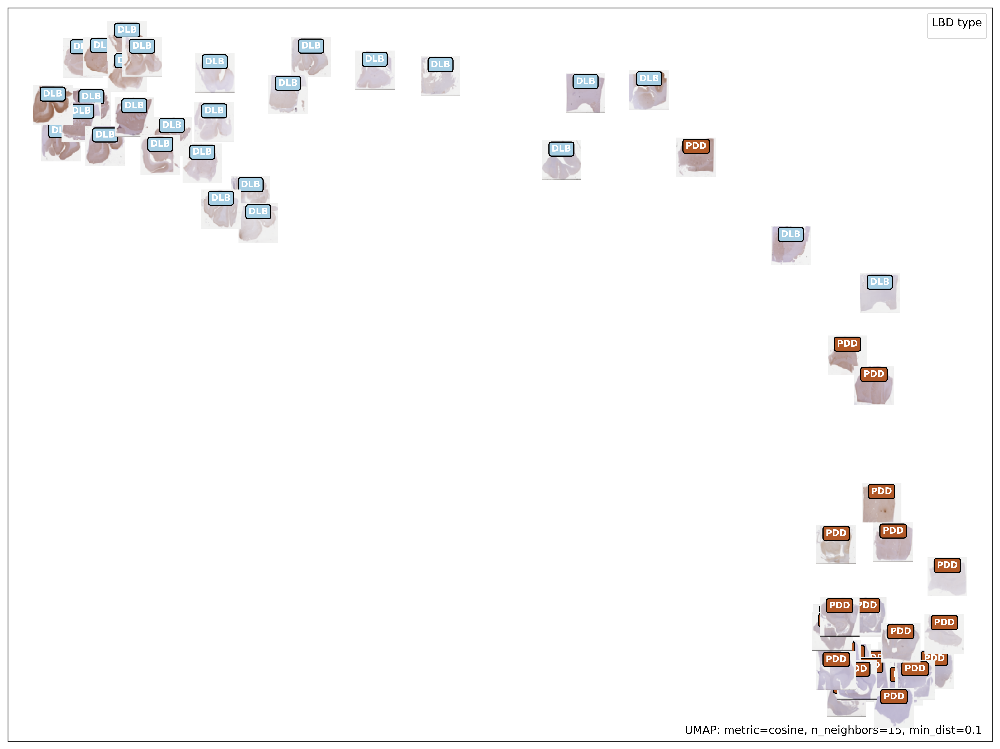
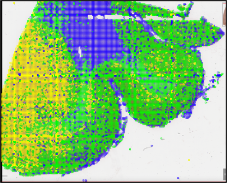

# Using Prov-GigaPath codes as basis for training my data; The code has been updated by me with interpretability techniques

## Basis: A whole-slide foundation model for digital pathology from real-world data

[[`Model`](https://huggingface.co/prov-gigapath/prov-gigapath)] [[`Paper`](https://aka.ms/gigapath)] [[`BibTeX`](#Citation)]

Hanwen Xu*, Naoto Usuyama*, Jaspreet Bagga, Sheng Zhang, Rajesh Rao, Tristan Naumann, Cliff Wong, Zelalem Gero, Javier González, Yu Gu, Yanbo Xu, Mu Wei, Wenhui Wang, Shuming Ma, Furu Wei, Jianwei Yang, Chunyuan Li, Jianfeng Gao, Jaylen Rosemon, Tucker Bower, Soohee Lee, Roshanthi Weerasinghe, Bill J. Wright, Ari Robicsek, Brian Piening, Carlo Bifulco, Sheng Wang, Hoifung Poon (*Equal Contribution)

[]()

## Model Overview

<p align="center">
     <br>

  *Overview of Prov-GigaPath model architecture*

</p>

## Install

On an NVIDIA A100 Tensor Core GPU machine, with CUDA toolkit enabled.

1. Download our repository and open the Prov-GigaPath
```
git clone https://github.com/prov-gigapath/prov-gigapath
cd prov-gigapath
```

2. Install GigaPath and its dependencies

```Shell
conda env create -f environment.yaml
conda activate gigapath
pip install -e .
```
## Citation
```bibtex
@article{xu2024gigapath,
  title={A whole-slide foundation model for digital pathology from real-world data},
  author={Xu, Hanwen and Usuyama, Naoto and Bagga, Jaspreet and Zhang, Sheng and Rao, Rajesh and Naumann, Tristan and Wong, Cliff and Gero, Zelalem and González, Javier and Gu, Yu and Xu, Yanbo and Wei, Mu and Wang, Wenhui and Ma, Shuming and Wei, Furu and Yang, Jianwei and Li, Chunyuan and Gao, Jianfeng and Rosemon, Jaylen and Bower, Tucker and Lee, Soohee and Weerasinghe, Roshanthi and Wright, Bill J. and Robicsek, Ari and Piening, Brian and Bifulco, Carlo and Wang, Sheng and Poon, Hoifung},
  journal={Nature},
  year={2024},
  publisher={Nature Publishing Group UK London}
}
```

## Model Download

The Prov-GigaPath models can be accessed from [HuggingFace Hub](https://huggingface.co/prov-gigapath/prov-gigapath).

You need to agree to the terms to access the models. Once you have the necessary access, set your HuggingFace read-only token as an environment variable:
```
export HF_TOKEN=<huggingface read-only token>
```

If you don’t set the token, you might encounter the following error:
```
ValueError: We have no connection or you passed local_files_only, so force_download is not an accepted option.
```

## How it works

The Prov-GigaPath model consists of a tile encoder, that extracts local patterns at patch level, and a slide encoder, that outputs representations at slide level. This model can be used in both tile-level and slide-level tasks. When doing inference at the slide level, we recommend following this pipeline: (1) Tile the whole slide into N image tiles, with the coordinates of each tile. (2) Get the embeddings for each tile using our tile encoder. (3) Pass the N image tile embeddings and their coordinates into the slide encoder, to get slide level representations.

## Our Results
We fine-tune gigapath models on our alpha syn stained whole slide tissue images to distinguish PDD and DLB brains- Accuracy of 92.3%
Confusion matrix as follows:
<p align="center">
     <br>
    *Confusion Matrix*
</p>

<p align="center">
     <br>

  *Umap plot*

</p>

Attention maps obtained at slide level, focusing on differnt patterns in image
<p align="center">
     <br>
    *Attention Head*
</p>


